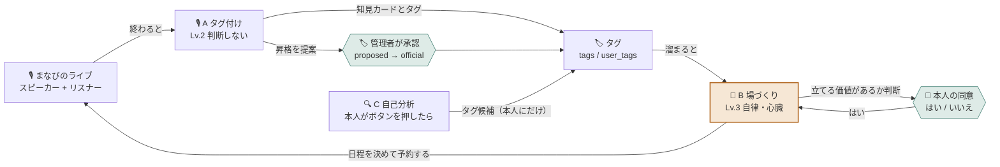
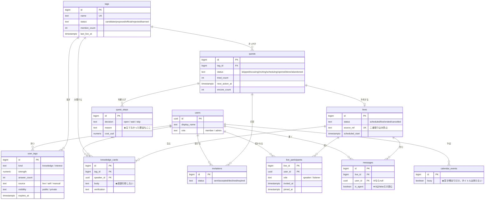

# 学びの輪 — 設計書

社内の会話から「いま誰が何を知りたがっていて 誰がそれを知っているか」を読み取り、
**場を立てる価値があるとAIが自分で判断したときだけ** 人に声をかけて学びの場を立ち上げるプラットフォーム。

- 大会: AI HACK 2026（テーマ「業務を自律化するAIエージェント」）
- 必須: OrcaRouter（OpenAI互換のAI推論ゲートウェイ）を通すこと

---

## 0. このファイルの使い方

**実装の前に必ずここを読む。** 決まったことはここに書き戻す。
`§8 絶対に壊してはいけないルール` は、踏むと設計の意図が崩れるものだけを集めてある。
**コードを書く前と PR を出す前に §8 を読み直すこと。**

---

## 1. 用語

| 用語 | 意味 |
|---|---|
| **まなびのライブ** | 学びの場。インスタライブ／Xのスペース形式。**必ず始まりと終わりがある** |
| **スピーカー** | ライブで音声を話す人。知見を持っている側 |
| **リスナー** | 聞くだけの人。チャットでコメントできる。**聞くだけの参加が正式な席** |
| **タグ** | 知識の単位。`知見タグ`（詳しい）と `興味タグ`（知りたい）の2種類。**「ラベル」とは呼ばない** |
| **タグ辞書** | `tags` テーブル。**候補・格上げ候補・正式・弾いた語・禁止を1枚で持つ**。全員に見えるのは正式タグだけ（§5.4） |
| **格上げ候補** | 条件を満たしたので Aが「正式にしませんか」と管理者に出したタグ（`proposed`）。**正式にできるのは管理者だけ** |
| **知見カード** | ライブから切り出された知識のかけら。タグと1対1。話した人が紐づく |
| **企て（quest）** | エージェントが抱えている未完了の仕事。日をまたいで1つのゴールを追う |
| **三重の門** | タグの正しさを守る仕組み。形／中身／本人 の3段 |

---

## 2. 全体像

### 2.1 エージェント設計図



> **口を持っているのは 🎪B だけ。** 通知を送る権限は B のキーにしか渡さない。
> A が乗っ取られても 外に出ていくものがない。
> 4つの層が輪になっている: **集まる → 残る → 知る → つながる → また集まる**

---

## 3. エージェント

3体ともトリガーが違う。だから別のエージェントとして分ける。

| | 🎙️ A タグ付けエージェント | 🎪 B 場づくりエージェント | 🔍 C 自己分析エージェント |
|---|---|---|---|
| **起動** | ライブが終わったら | 1日1回 自分で | 本人がボタンを押したら |
| **読む** | トランスクリプト・チャット | タグ・企て・予定・過去の結末 | 画面の静止画 |
| **書く** | 知見カード・タグ | 企て・ライブ・通知 | タグ候補（本人にだけ） |
| **人に喋る** | **できない** | できる | できない |
| **APIキー** | `ORCA_KEY_RECORDER` 通知権限なし | `ORCA_KEY_ORGANIZER` 通知あり | `ORCA_KEY_MIRROR` |
| **主なモデル** | 安い担当（量が多い） | 強い担当（回数は少ない） | vision |
| **自律レベル** | Lv.2 自動化（判断しない） | **Lv.3 自律（心臓）** | Lv.2 |

> **口を持っているのは B だけ。** 通知を送る権限は B のキーにしか渡さない。
> 乗っ取られても A は他人に何も言えない。これが「機能の分離」ではなく **「権限の分離」**。

### 3.1 🎙️ A タグ付けエージェント

**トリガー**: ライブが `ended` になったら（`lives.ingest_status = 'pending'` を拾う）

**やること（順番）**

1. 文字起こし（`transcript_segments`）とチャットを読む
   - 文字起こしの各行は **最初から `user_id` を持っている**（参加者は各自のアカウントでライブに入るため、音声が出た時点で誰の声か確定している）
   - **`messages.is_agent = false` のものだけ**（AIの発言を入力にしない）
2. 知見カードを切り出す（構造化出力）
   - **本文に発言をそのまま引用しない。必ず要約する**（カードは全社公開のため）
3. タグを決める → **三重の門**（§5）を通す
   - 正式タグにある話題は **表記を正式タグに揃える**（参考として正式タグの一覧を渡す）
   - **細かい話題・新しい分野は新しい語で出してよい**。門1を通った新語は **候補** として辞書に入る
4. 話者は **行が持つ `user_id` をそのまま使う**。名前で照合しない
   - LLMには **行番号 `[s12]` だけ** を見せ、話者も行番号で返させる。LLMは名前も `user_id` も扱わない
   - **渡していない行番号を指したら**、そのカードは捨て、ライブは `done` ではなく **`ingest_status = 'needs_review'`** で止める
5. 知見カードと `user_tags` を作る（**候補タグでも作る**）
   - 格上げの判定材料が `user_tags` そのものだから（何人が語ったか）
   - 格上げされた瞬間に、過去に語った人全員へ **遡って反映される**（`user_tags` は `tag_id` を指しているだけなので、`tags.status` を1行変えるだけで済む）
6. 語られるたびに `tag_mentions` に1行残し、**直近30日に 延べ3回 または 2人以上** が語った候補を `proposed`（格上げ候補）にする（数字は設定で変えられる。§5.4）
   - **自分で `official` にはしない**。管理者の承認だけが正式にする（§4 ゲート2）
7. 「またやりたい」という趣旨の発言があれば `quests.encore_count` に数える
   - 2 と同じ構造化出力の1項目にする。**LLMの追加呼び出しはしない**

**コスト方針**: 無料モデル（Union Alpha）でまず足切り → 残った発言だけ強いモデルへ

### 3.2 🎪 B 場づくりエージェント

**トリガー**: 1日1回（Vercel Cron）＋ 進行中の企てがあれば毎回見に行く

**やること（順番）**

1. 進行中の企てを全部見て、それぞれの次の一手を決める
2. 新しく立てる価値のあるタグを探す
3. **「立てるか」を毎回判断する**（§3.3）
4. 相談役の候補をコードで作る → LLM は**その中から選ぶだけ**
5. 打診する（`invitations`）
6. OKが出たら **予定を見て日程を決める**（`calendar_events` の free/busy のみ）
7. ライブを予約する → 最初の一言を書く
8. 誰も喋っていなければ呼び水を投げる
9. 企てを閉じて `outcome` を残す

**判断は3値で出す**

```json
{
  "decision": "open" | "wait" | "skip",
  "confidence": 0.0,
  "reason": "なぜそう判断したか",
  "next_review_at": "wait のときだけ"
}
```

`wait`（まだ）を選べるようにするのが重要。2値だとAIは必ずどちらかに倒す。
**判断はすべて `quest_steps` に理由つきで残す。立てなかった判断も残す。**

### 3.3 「立てる価値があるか」の判断材料

数だけで決めない。以下を材料としてLLMに渡す。

| # | 材料 | 取り方 |
|---|---|---|
| 1 | 前回からの間隔 | `tags.last_live_at` |
| 2 | **顔ぶれの入れ替わり** | 前回の `quests.interested_ids` との差分 |
| 3 | 興味の勢い | この1週間で `user_tags` が何人に新しく付いたか |
| 4 | 前回の反応 | `quests.attendee_count` `message_count` `cards_created` |
| 5 | **アンコール** | `quests.encore_count` |
| 6 | 話題の進展 | 前回と違う知見カードが溜まっているか |
| 7 | 相談役の負担 | 直近の `invitations` の数 |

**ハードリミット（コードで保証する。LLMに任せない）**

- 前回のライブ終了から **14日** は絶対に立てない
- 同じ人への打診は **1週間に2回まで**
- 候補 **3人** に断られたら諦めて管理者へエスカレーション
- 1つの企てが **14日** 動かなければ諦める

### 3.4 🔍 C 自己分析エージェント

**トリガー**: プロフィール画面のボタン

**やること**

1. ブラウザの画面共有API（`getDisplayMedia`）で共有を開始する
   - **共有する範囲は本人がOSのダイアログで選ぶ**
2. 開始時に**終了時刻を宣言する**。時間が来たら自分で止まる
3. 数分おきに静止画を1枚だけ取って溜める。前の1枚とほぼ同じなら捨てる
4. 終了時に、溜めた静止画を**1枚ずつ**モデルに渡す（並列でよい）。各画像には
   「その1枚に映っている作業・道具・分野」だけを答えさせ、辞書（正式・育ちかけ）も
   毎回渡して**表記をそのタグの表記に揃えさせる**（recorder.mjsが`<growing>`で
   育ちかけタグを渡す仕組みと同じ考え方。表記がばらけるとコード側の集計が数えられない）
5. 🚪門1（辞書照合・表記ゆれ吸収）を画像ごとに通したあと、
   **同じタグが何枚に出たかをコードで数える**。`MIRROR_MIN_FRAMES`（既定2枚）
   **以上**に出たタグだけ残す。確信度はLLMの自己申告ではなく
   「出た枚数 ÷ 全枚数」で**コードが計算する**。1枚にしか出なかったタグは、
   理由つきでログに残して捨てる
   - ★ 2026-09-21変更: 以前は「終了時にまとめて1回だけモデルに渡す」設計だったが、
     実データ検証（`docs/evidence/20260921-mirror-real-shots.md`）で
     「複数枚にまたがらない要素は出さない」というプロンプトの指示がLLMに守られない
     ことが再現性をもって確認されたため、この判定をLLMの自己申告からコードに移した
     （`docs/evidence/20260921-mirror-real-shots.md`に修正前後の比較あり）
6. 残ったタグ候補を三重の門を通したうえで **本人にだけ見せる**
7. タグ候補は最初から `user_tags` に `source='self'`, `visibility='private'` で入る
   - **本人にしか見えない**（`user_tags` の select ポリシーで保証）
   - 「採用」＝ `set_tag_visibility()` で `private → public` に切り替える操作
   - ★ 採用待ちのための**新しいテーブルは作らない**。状態は `visibility` が持つ

**画像は一切保存しない。** DBに画像を持つ列を作らない。ログにも出さない。

---

## 4. 人が介在する場所は4つだけ

| | ゲート | 誰が | 何を |
|---|---|---|---|
| 1 | 🚪 **相談役への打診** | 打診された本人 | はい／いいえ。**断れることが大事** |
| 2 | 🏷️ **タグ格上げの承認** | 管理者 | `proposed` → `official` |
| 3 | 🙋 **話者を確定できない取り込み** | 管理者 | 参加者以外の発言が混ざった文字起こしは **ライブを開かない**。AIが渡していない行番号を指したライブは `needs_review` で止まる。**AIは人を推測しない・社員を作らない** |
| 4 | 🚨 **例外エスカレーション** | 管理者 | Firewallが弾いた／候補が尽きた／確信度が割れた |

> **これ以外の判断はすべてAIが自分で決める。**
> 語り方は「全部AIがやります」ではなく
> **「人の介在点を4か所に絞って設計しました」**。

---

## 5. 三重の門 — タグの正しさを守る

「正しさ」は1つの問題ではなく3つの問題。分けると別々の道具で解ける。

| 何が起きるか | 実例 | 受ける門 |
|---|---|---|
| 言葉が壊れる | 知見 → 治験 ／ チキンラベル | 門1 形 |
| 中身が間違っている | 自信なく喋った話が事実として違う | 門2 中身 |
| 貼られたくない | 聞かれても困るから付けたくない | 門3 本人 |

### 門1｜形

- **正式タグにあるものはそのまま通す**（0円）
- **辞書にない新語は 3つの検査を通す**

| 検査 | 内容 | コスト |
|---|---|---|
| 1. 形 | 20文字以内／**空白・改行・句読点・記号を含まない**／1文字や数字だけは落とす | 0円（正規表現） |
| 2. 固有名詞 | 禁止リストとの照合 ＋「**概念か 固有名か**」の判定 | 安いモデル |
| 3. 空似 | 既存の正式タグの**かな読み**と比べて言い間違いなら既存に寄せる | 安いモデル |

> 検査1でインジェクションはほぼ死ぬ。**命令は必ず「文」だから。**
> 検査3は**かな読みで比べる**こと。「治験」と「知見」は漢字を1文字も共有していない。

落ちた語は `status = 'rejected'` にして `rejected_reason` を残す。
`tags.name` が UNIQUE なので、一度弾けば二度と候補に湧かない。

**今回の実装範囲**

| 検査 | 実装 |
|---|---|
| 1. 形 | ✅ 正規表現 |
| 2. 固有名詞 | 🟡 禁止リスト（`banned`）との一致だけ。LLMによる「概念か固有名か」の判定は範囲外（§10） |
| 3. 空似 | 🟡 **表記ゆれ**（空白・全角半角・大小文字）だけ正式タグに寄せる（`PowerAutomate` → `Power Automate`）。確実な誤変換は `alias_of` で直接つなぐ（`治験` → `知見`）。かな読みの判定は範囲外（§10） |

### 5.4 タグの一生（9/20 会議で確定）

**AIが勝手に格上げするのは危ない。格上げ候補として出すところで止める。正式にするのは管理者。**

| 状態 | 意味 | 誰が決める | 誰に見える |
|---|---|---|---|
| `candidate` 候補 | 会話に出てきた。まだ数が足りない | 🎙️A | 管理者 |
| `proposed` 格上げ候補 | **直近30日に 延べ3回 または 2人以上** が語った | 🎙️A | 管理者（管理者ビューの「承認待ち」） |
| `official` 正式 | 全社の語彙。知識地図に載る | 🙋 **管理者だけ** | 全員 |
| `rejected` 弾いた語 | 門1で落ちた（誤変換・長すぎる・記号入りなど） | 🎙️A | 管理者 |
| `banned` 禁止 | 人が禁止にした（社名・顧客名など） | 🙋 管理者 | 管理者 |

- **タグは一旦ぜんぶ付けて、状態で制御する。** 候補の段階から知見カードも `user_tags` も作る
- 正式になった瞬間、過去に語った人全員に **遡って** 付く（バックフィル処理は要らない）
- 延べ回数だけだと1人の連投で上がるが、**1人が何度も語る情熱も拾いたい**ので「延べ3回 **または** 2人以上」にしている
- **期間で区切る。** 半年前に1回話しただけの話題が いつまでも数に残らないように、判定は直近の記録（`tag_mentions`）だけで数える。`tags.mention_count` は累計の表示用
- **★ 9/21 決定（案B）: 「誰に見える」は `tags` の行だけでなく、そのタグを指す `knowledge_cards` と `user_tags` にも及ぶ。** `candidate`/`proposed`の間は、そのタグが付いた知見カードも人のタグも
  **管理者・話した本人・貼られた本人以外には見えない**（0010で `knowledge_cards`/`user_tags` の select ポリシーを、タグが `official` かどうかも条件に含める形に直した）。
  `official`になった瞬間、`tags`の1行を書き換えるだけで、過去のカードも人のタグも一斉に全員へ見えるようになる（バックフィル不要、という上の性質がそのまま活きる）

**格上げの条件は会社ごとに変える値**

閾値が決めているのは「タグの正しさ」ではなく **管理者の承認待ちが週に何件届くか**。後ろに必ず承認があるので、甘くても間違ったタグが勝手に正式になることはない。代わりに承認待ちが溜まり、**管理者が見ずに押すようになった時点でゲートは形だけになる**。だから閾値は、その会社の管理者が捌ける量に合わせる。

| 設定（`.env.local`） | 意味 | 既定（デモ） | 目安 〜50人 | 目安 〜300人 |
|---|---|---|---|---|
| `TAG_PROPOSE_MIN_SPEAKERS` | 何人が語ったら（広がり） | 2 | 2 | 3 |
| `TAG_PROPOSE_MIN_MENTIONS` | 1人でも延べ何回語ったら（情熱） | 3 | 5 | 8 |
| `TAG_PROPOSE_WINDOW_DAYS` | 直近何日を数えるか（0で区切らない） | 30 | 30 | 30 |

本番では管理者が画面から設定する想定（今回は画面が無いので環境変数。§10）
- **B は状態を見ない**（§8 ルール9・14）。正式化は「全社の語彙になるか」、企ては「人と人をつなぐか」で別のレイヤー

### 門2｜中身

- **タグは人に直接貼らない。まず知見カードに貼り、カードが集まって初めて人のタグになる**
- 1回の誤変換や1回の勘違いでは人のタグが動かない（**冗長性で守る**）
- 裏取りは「人」ではなく「カード」に対してやる → `knowledge_cards.verification`
- 検証するのは「発言が真実か」ではなく **「この人が詳しいと言えるか」**
- 自己申告だけでは育てない。**他人に答えた実績**（`user_tags.answer_count`）を重みにする

### 門3｜本人

- 「貼っていいですか」で止めない（待ち行列になる）
- 貼ってから通知して「違ったら外してね」＝ **オプトアウト**
- 公開／非公開は本人が選ぶ（`user_tags.visibility`）

---

## 6. データモデル

### 6.0 テーブル設計図

データも輪になっている。**ライブ → 知見カード → 人のタグ → 企て → またライブ。**



**かたまりで見るとこうなる。**

| かたまり | テーブル | 守りの要 |
|---|---|---|
| 👤 人 | `users` `user_tags` | `users` に update ポリシーを作らない／`visibility` |
| 🏷️ 知識 | `tags` `knowledge_cards` | **カードの `tag_id` が `tags` を参照＝辞書外は入らない** |
| 🎙️ 場 | `lives` `live_participants` `messages` `transcript_segments` | `source_ref` UNIQUE／**終了後は参加できない**／**その場にいない人の発言は外部キーで作れない** |
| 🎪 自律 | `quests` `quest_steps` `invitations` | **タグごとに進行中は1つまで**／ブラウザから見えない |
| 📅 予定 | `calendar_events` | **本人だけ。** タイトルも参加者も持たない |
| 🧾 記録 | `agent_runs` | ②のレシートと ③の再開。ブラウザから見えない |

### 6.1 テーブル一覧

| テーブル | 中身 | 書く人 | 優先 |
|---|---|---|---|
| `users` | 社員 | — | 🔴 |
| `tags` | タグ辞書（候補と正式を1枚で） | A / 管理者 | 🔴 |
| `knowledge_cards` | 知見カード。タグと1対1 | A | 🔴 |
| `user_tags` | 人に付いたタグ（知見と興味を1枚で） | A / C | 🔴 |
| `lives` | まなびのライブ。1回が1行 | B | 🔴 |
| `live_participants` | 招待と参加。speaker / listener | B / 本人 | 🔴 |
| `messages` | リスナーのコメント | 本人 / B | 🔴 |
| `quests` | 企て | B | 🔴 |
| `quest_steps` | 判断ログ | B | 🔴 |
| `invitations` | 打診 | B | 🔴 |
| `transcript_segments` | 文字起こしの1行。**最初から `user_id` を持つ**。`(live_id, user_id)` は `live_participants` への複合外部キー | ライブ本体 | 🔴 |
| `tag_mentions` | タグが「いつ・誰に」語られたか。格上げを期間で判定するため。**ブラウザからは見えない**（ポリシー無し） | A | 🔴 |
| `agent_runs` | 実行記録（レシートと再開） | 全員 | 🔴 |
| `calendar_events` | 予定（デモではダミー） | — | 🟡 |
| `self_analysis_sessions` | 自己分析の記録。**画像は持たない** | C | ⚪ |

### 6.2 DDL

```sql
-- 社員
create table users (
  id           uuid primary key references auth.users(id),
  display_name text not null,
  department   text,
  role         text not null default 'member' check (role in ('member','admin')),
  created_at   timestamptz not null default now()
);

-- タグ辞書（候補・提案・正式・弾いた・禁止 を1枚で持つ）
create table tags (
  id                bigserial primary key,
  name              text not null unique,
  kind              text not null check (kind in ('分野','技術','業務')),
  status            text not null default 'candidate'
                    check (status in ('candidate','proposed','official','rejected','banned')),
  mention_count     int  not null default 0,
  last_mentioned_at timestamptz,
  last_live_at      timestamptz,
  alias_of          bigint references tags(id),   -- 空似の寄せ先
  rejected_reason   text,
  proposed_at       timestamptz,
  promoted_at       timestamptz,
  reviewed_by       uuid references users(id),
  reviewed_at       timestamptz,
  review_note       text,
  created_at        timestamptz not null default now()
);

-- まなびのライブ
create table lives (
  id              bigserial primary key,
  title           text,
  topic_tag_id    bigint references tags(id),
  quest_id        bigint,
  status          text not null default 'scheduled'
                  check (status in ('scheduled','live','ended','cancelled')),
  scheduled_start timestamptz,
  scheduled_end   timestamptz,
  started_at      timestamptz,
  ended_at        timestamptz,
  source_ref      text unique,                    -- 音声トランスクリプトID（二重取り込み防止）
  ingest_status   text not null default 'pending',
  created_at      timestamptz not null default now()
);

-- 招待と参加（行があれば 過去の会話を読める）
create table live_participants (
  live_id    bigint not null references lives(id),
  user_id    uuid   not null references users(id),
  role       text check (role in ('speaker','listener')),   -- 参加したら決まる
  invited_at timestamptz,
  joined_at  timestamptz,
  primary key (live_id, user_id)
);

-- リスナーのコメント
create table messages (
  id         bigserial primary key,
  live_id    bigint not null references lives(id),
  user_id    uuid references users(id) default auth.uid(),  -- AIの発言なら null
  body       text not null,
  is_agent   boolean not null default false,
  created_at timestamptz not null default now()
);
create index on messages (live_id, created_at);

-- 知見カード（タグと1対1・話した人が付く）
create table knowledge_cards (
  id           bigserial primary key,
  live_id      bigint not null references lives(id),
  tag_id       bigint not null references tags(id),
  speaker_id   uuid   not null references users(id),
  headline     text not null,
  body         text not null,          -- ★ 逐語引用しない。要約する
  verification text not null default 'unverified'
               check (verification in ('unverified','verified','rejected')),
  confidence   numeric(3,2),
  view_count   int  not null default 0,
  created_at   timestamptz not null default now()
);

-- 人に付いたタグ（知見と興味を1枚で）
create table user_tags (
  id           bigserial primary key,
  user_id      uuid   not null references users(id),
  tag_id       bigint not null references tags(id),
  kind         text not null check (kind in ('knowledge','interest')),
  strength     numeric(5,2) not null default 0,
  answer_count int  not null default 0,          -- 他人に答えた実績
  source       text not null check (source in ('live','self','manual')),
  visibility   text not null default 'public' check (visibility in ('public','private')),
  expires_at   timestamptz,                      -- 賞味期限つき興味タグ
  updated_at   timestamptz not null default now(),
  unique (user_id, tag_id, kind)
);

-- 企て
create table quests (
  id                bigserial primary key,
  tag_id            bigint not null references tags(id),
  previous_quest_id bigint references quests(id),
  status            text not null default 'scouting'
                    check (status in ('skipped','scouting','inviting','scheduling',
                                      'opened','done','abandoned')),
  interested_ids    uuid[] not null,
  current_invitee   uuid references users(id),
  tried_count       int not null default 0,
  live_id           bigint references lives(id),
  next_action_at    timestamptz,
  reevaluate_at     timestamptz,
  attendee_count    int,
  message_count     int,
  cards_created     int,
  encore_count      int,
  outcome           text,
  created_at        timestamptz not null default now(),
  closed_at         timestamptz
);

-- ★ タグごとに 進行中の企ては1つまで（毎日同じ部屋が立つのを防ぐ）
create unique index quests_one_active_per_tag
  on quests (tag_id)
  where status in ('scouting','inviting','scheduling','opened');

-- 判断ログ（立てなかった理由もここ）
create table quest_steps (
  id         bigserial primary key,
  quest_id   bigint not null references quests(id),
  kind       text not null,          -- judge / invite / remind / giveup / schedule / open / nudge
  decision   text not null,          -- open / wait / skip / ...
  reason     text not null,
  model      text,
  cost_usd   numeric(10,6),
  created_at timestamptz not null default now()
);

-- 打診
create table invitations (
  id           bigserial primary key,
  quest_id     bigint not null references quests(id),
  user_id      uuid   not null references users(id),
  status       text not null default 'sent'
               check (status in ('sent','accepted','declined','expired')),
  sent_at      timestamptz not null default now(),
  responded_at timestamptz
);

-- 予定（★ タイトルも参加者も持たない。空き／埋まりだけ）
create table calendar_events (
  id        bigserial primary key,
  user_id   uuid not null references users(id),
  starts_at timestamptz not null,
  ends_at   timestamptz not null,
  busy      boolean not null default true
);
create index on calendar_events (user_id, starts_at);

-- エージェントの実行記録（②のレシートと ③の再開）
create table agent_runs (
  id            bigserial primary key,
  agent         text not null check (agent in ('A','B','C')),
  trigger       text not null,
  status        text not null default 'running'
                check (status in ('running','succeeded','failed')),
  ref_id        text,
  model         text,
  input_tokens  int,
  output_tokens int,
  cost_usd      numeric(10,6),
  error         text,
  started_at    timestamptz not null default now(),
  finished_at   timestamptz
);

alter table lives add constraint lives_quest_fk
  foreign key (quest_id) references quests(id);

-- 文字起こし（0008）。★ 名前の文字列は持たない。発言は最初からアカウントに紐づく
create table transcript_segments (
  id        bigserial primary key,
  live_id   bigint not null,
  user_id   uuid   not null,          -- 音声が入った時点で確定する。推測しない
  seq       int    not null,          -- ライブ内の通し番号。LLMにはこの番号だけ見せる
  spoken_at timestamptz,
  body      text   not null,
  -- ★ その場にいない人の発言は作れない。service_role（RLSを素通りする鍵）でも破れない
  foreign key (live_id, user_id) references live_participants(live_id, user_id),
  unique (live_id, seq)
);
```

### 6.3 用語がぶつかる箇所（実装で混ざりやすい）

| 列 | 意味 |
|---|---|
| `users.role` | `admin` / `member` — **アカウントの権限** |
| `live_participants.role` | `speaker` / `listener` — **そのライブでの立ち位置** |

---

## 7. RLS

**テーブルを作ったら必ず同じ回で書く。あとから付けると必ず漏れる。**

> 実際に流す SQL は `supabase/migrations/` にある。ここは考え方の説明。
> `0001_schema.sql` → `0002_rls.sql` → `0003_seed.sql` の順に実行し、`supabase/checks.sql` で確認する。

```sql
alter table users                  enable row level security;
alter table tags                   enable row level security;
alter table knowledge_cards        enable row level security;
alter table user_tags              enable row level security;
alter table lives                  enable row level security;
alter table live_participants      enable row level security;
alter table messages               enable row level security;
alter table quests                 enable row level security;
alter table quest_steps            enable row level security;
alter table invitations            enable row level security;
alter table calendar_events        enable row level security;
alter table agent_runs             enable row level security;

-- 社員名簿：読むだけ。★ update ポリシーは意図的に作らない
-- （作ると自分の role を admin に書き換えられてしまう）
create policy "社員は全員読める" on users
  for select to authenticated using (true);

-- タグ：正式タグは全員／候補・弾いた語は管理者だけ
create policy "正式タグは全員 それ以外は管理者" on tags
  for select to authenticated
  using (
    status = 'official'
    or exists (select 1 from users where id = auth.uid() and role = 'admin')
  );

create policy "管理者だけタグを裁ける" on tags
  for update to authenticated
  using (exists (select 1 from users where id = auth.uid() and role = 'admin'));

-- 知見カード：全社公開（本文は要約なので出してよい）
create policy "知見カードは全員読める" on knowledge_cards
  for select to authenticated using (true);

-- 人に付いたタグ：公開は全員／非公開は本人だけ
create policy "公開は全員 非公開は本人だけ" on user_tags
  for select to authenticated
  using (visibility = 'public' or user_id = auth.uid());

-- ★ update ポリシーは作らない（strength や answer_count を自分で盛れてしまう）
--    公開設定の変更だけ security definer 関数で許可する → set_tag_visibility()

-- ライブと参加者：一覧は全員に見える
create policy "ライブは全員見える" on lives
  for select to authenticated using (true);
create policy "参加者は全員見える" on live_participants
  for select to authenticated using (true);

-- ★ 終了したライブには 誰も参加できない（過去ログが後から広がらない）
create policy "開催中のライブにだけ参加できる" on live_participants
  for insert to authenticated
  with check (
    user_id = auth.uid()
    and exists (select 1 from lives l where l.id = live_id and l.status = 'live')
  );

-- 元発言：誘われた人だけ読める
create policy "誘われた人だけ読める" on messages
  for select to authenticated
  using (exists (
    select 1 from live_participants lp
    where lp.live_id = messages.live_id and lp.user_id = auth.uid()
  ));

create policy "自分としてだけ投稿できる" on messages
  for insert to authenticated
  with check (user_id = auth.uid() and is_agent = false);

-- 打診：自分宛だけ
create policy "自分宛の打診だけ見える" on invitations
  for select to authenticated using (user_id = auth.uid());
-- ★ update ポリシーは作らない（quest_id を書き換えて他人の企てに割り込める）
--    返事だけ security definer 関数で受ける → respond_invitation()

-- 予定：本人だけ（他人の空き時間が見えるのは それ自体が漏洩）
create policy "自分の予定だけ見える" on calendar_events
  for select to authenticated using (user_id = auth.uid());

-- 企て・判断ログ・実行記録：ポリシーを作らない
--   ＝ ブラウザからは一切見えない。エージェント（service_role）だけが触る
```

---

## 8. 絶対に壊してはいけないルール

**実装で踏みやすく、踏むと採点で致命傷になるものだけを集めた。**

| # | ルール | 破るとどうなるか |
|---|---|---|
| 1 | `users` に **update ポリシーを作らない** | 一般社員が自分を管理者に昇格できる |
| 1.5 | **update ポリシーは「どの列を」縛れない。** 列を守りたいものは update ポリシーを作らず `security definer` 関数にする（`user_tags` `invitations` も同じ） | 強さを自分で盛る／他人の企てに割り込む |
| 2 | LLM が返した `user_id` は **必ず候補リストと照合してから使う**。できるなら **LLMに `user_id` を渡さない**（Aは行番号だけ扱う） | インジェクションで任意の人に通知を送れる |
| 3 | エージェントのAPIは **`CRON_SECRET` で縛る** | 誰でも叩けてクレジットが溶ける／打診が乱射される |
| 4 | `service_role` を読むファイルの1行目に **`import 'server-only'`** | ブラウザに焼き込まれて全データが読み書きされる |
| 5 | A の入力は **`is_agent = false` の発言だけ** | AIが自分の発言から知見を作り タグが自己増殖する |
| 6 | 知見カードの本文に **発言を逐語引用しない。要約する** | 「元発言は参加者だけ」が形だけになる |
| 7 | 終了したライブには **誰も参加・招待できない** | あとから招待すれば過去ログが読めてしまう |
| 8 | タグは **AIが `official` にしない**。`proposed` まで | 管理者の承認という設計が意味をなくす |
| 9 | ただし **管理者が承認しなくても B は止まらない** | 管理者が見ていない週末は場がひとつも立たない＝自律性が死ぬ |
| 10 | 企ての停止条件（14日／3人／コスト上限）は **コードで持つ。LLMに任せない** | ループが止まらず課金され続ける |
| 11 | カレンダーは **free/busy だけ取る**。タイトルも参加者も読まない | 「A社との商談」が1つ漏れるだけで事故 |
| 12 | C は **画像を保存しない**。DBに画像の列を作らない | 社外秘が写り込んだまま残る |
| 13 | タグは **自由文にしない**。カードも人のタグも **辞書（`tags`）の行を指す**。新しい語は門1を通って **候補として辞書に入ってから** 使う | インジェクションで任意の文字列が書き込める |
| 14 | 企ては **`user_tags` の重なりだけで判断する**。正式か候補かで絞らない（ただし人が禁止した `banned` と、門1で弾いた `rejected` は対象外） | ルール9が崩れる／弾いた語・禁止語で場が立つ |
| 15 | **話者を名前で照合しない。** 文字起こしは `user_id` 付きの行で受け取り、エージェントは社員アカウントを作らない | 表記ゆれ（`星野陸` / `星野 陸`）で同一人物が増殖する。1行書き足すだけで **他人の名義でタグが作れる** |

> **9 の補足**: タグの正式化は「**全社の語彙になるか**」、企ては「**人と人をつなぐか**」。
> 別のレイヤーなので独立させられる。ここを混ぜると自律性が死ぬ。

> **7 の補足**: これは **ブラウザ（anonキー・RLS経由）向けの縛り**。
> ライブ本体が参加を確定させる経路（`open-live.mjs`。`service_role`）は別で、
> RLSを素通りするので終了済み（`status='ended'`）のライブにも `live_participants` を書ける。
> これは「デモの文字起こしを取り込む」という運用上必要な動きであり、
> ブラウザから一般社員が終了後に紛れ込む穴とは別物。

---

## 9. OrcaRouter

```
base_url = https://api.orcarouter.ai/v1
```

**キーは1つのアカウントから3本発行する。**（権限を分けたうえで 利用明細が1か所にまとまる）

| 変数 | 用途 | 権限 |
|---|---|---|
| `ORCA_KEY_RECORDER` | 🎙️ A | 通知なし・予算小 |
| `ORCA_KEY_ORGANIZER` | 🎪 B | 通知あり・予算あり・期限つき |
| `ORCA_KEY_MIRROR` | 🔍 C | vision・予算小 |

**Named Router を作って モデル名をコードに書かない。**

| 担当 | 使う場面 |
|---|---|
| Mundane（安い） | タグ貼り・要約・新語の検査・巡回の足切り |
| Hard（強い） | 立てるか判断・打診文・タグ昇格の最終確認 |
| Fallback | 候補に入れていない別ベンダーを1本（使われない限り課金なし） |

**実際の構成（9/21）** — 候補は **構造化出力（`response_format`）に対応したモデルだけ** で組んだ。3体とも JSON で受けるので、非対応のモデルに振られた瞬間に壊れるため

| ルーター | 戦略 | 候補 | フォールバック |
|---|---|---|---|
| `manabi-recorder` | アダプティブゲート | 簡易: `tencent/hy3-free`（無料） `openai/gpt-oss-120b` ／ 高難度: `qwen/qwen3.8-flash` | `google/gemini-2.5-flash-lite` |
| `manabi-organizer` | バランス | `anthropic/claude-sonnet-5` `openai/gpt-5.6-luna` | `qwen/qwen3.8-max` |
| `manabi-mirror` | バランス | `openai/gpt-5-nano` `google/gemma-4-26b-a4b-it` `qwen/qwen3.8-flash`（すべて画像対応） | `google/gemini-2.5-flash-lite` |

- A は高難度でも **フロンティア級（$10/$50）に上がらない**。量が多いエージェントに天井を付けた
- B に最上位モデルは置かない。候補選びはコードがやっていて、LLMは選ぶだけだから（1回 $0.09 → $0.018）
- フォールバック欄は、この画面では **デフォルトモデルと同じ1欄**

**ガードレール `manabi-pii`**（3本のキーにだけ明示的に紐づけ。アカウント既定にはしない）

| 対象 | 動き |
|---|---|
| メール・電話・APIキー（`sk-orca-` を含む）・JWT・AWSキー | **マスクして続行**（ライブでうっかり読み上げても取り込みは止めない） |
| クレジットカード番号 | **ブロック**（勉強会の会話に出る理由が無い。入力側で止まるので課金なし） |

**注意**

- PII Shield の既定は「マスク」。**氏名・住所・社名は既定では検出対象外** → うちは **文字起こしに名前を流さない設計**（§3.1）にしたので氏名ルールは足していない
- OpenAI SDK は既定で `max_retries=2`。自前のフォールバックより先にSDKが同じモデルへ再試行する
- 429 は **別プロバイダのモデルへ逃がす**と安定する

---

## 10. 今回の範囲外

設計としては決めたうえで、今回のスコープには入れていないもの。

| やらないこと | 今回の判断 |
|---|---|
| SSO（Entra ID / Google） | 認証は最初から Supabase Auth に寄せてあり（`users.id` が `auth.users(id)` を参照）、**provider を有効にするだけで入る**。実運用では情シスの承認が要るため今回は範囲外。★ メールアドレスは**ユーザーに打たせず IdP から受け取る**設計。打ち間違いでカレンダー連携が静かに壊れるのを防ぐため |
| マルチテナント分離 | 今回は1社前提。複数社に出すなら全テーブルに `org_id` を足して RLS の条件に入れる |
| キーの完全分離 | A と B のキーは分けたが同じプロセスにある。**防いでいるのは事故であって攻撃ではない** |
| カレンダー実連携 | デモはダミー。本番は Microsoft Graph の `getSchedule` を叩く。返るのは `availabilityView`（`0`空き / `1`仮 / `2`予定あり / `3`外出中）の文字列だけで、**予定のタイトルも参加者も返らない**。必要権限は最小の `Calendars.ReadBasic`。全社カレンダーを読むアプリ権限は**意図的に使わない** |
| リアルタイムの「現在の話題」 | コストと、雑談が部屋の外に漏れる懸念のため見送り |
| 定期開催の設定画面 | **作らない。** 興味が溜まれば結果として また開かれる |
| アカウント無しの参加・会議室の共有マイク | **認めない。** 1アカウント1マイクが前提。共有マイクを認めると話者分離が要り「誰の声か分からない音声」が戻ってくる。ゲスト参加はログイン設計で決める |
| 管理者の「まとめる」操作 | 似たタグ（例: `インデックス` と `インデックス最適化`）が別々に格上げ候補に上がってきても、**片方に寄せる操作は無い**。辞書には最初から寄せ先の列 `alias_of` があり、エージェントもそれを見て新しい発言は寄せるが、**過去のカード・人のタグ・語られた記録を付け替える処理は無い**。★「禁止」（`official`/`candidate`等 → `banned`）は範囲外ではない。管理者ビュー（`tags`画面）から**ブラウザ上で実装する**（§4） |
| 格上げ条件の設定画面 | 条件は `.env.local` の3つの値で変えられる（§5.4）。管理者が画面から変える形は Next.js の管理者ビューで作る |
| 門1の検査2・3の完全版 | 固有名詞のLLM判定と、かな読みでの空似判定。今回は禁止リストと表記ゆれの吸収まで（§5） |

> **穴がないふりをせず 穴の位置を正確に書くことを方針にしている。**

---

*最終更新: 2026-09-21 / 変更したらこのファイルに書き戻すこと*
