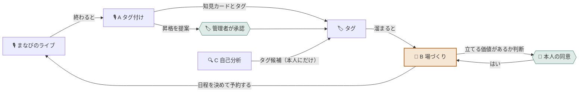

# まなびのわ

> 社内の会話から「いま誰が何を知りたがっていて 誰がそれを知っているか」を読み取り、
> **場を立てる価値があるとAIが自分で判断したときだけ** 人に声をかけて学びの場を立ち上げるプラットフォーム。

**幹事という役割を まるごとAIに渡します。**
人材育成担当に残るのは「やるよ」と言うことだけ。参加者に残るのは「出ます」の返事だけ。

- 📘 設計の正は [`DESIGN.md`](DESIGN.md)
- 🎙️ 声の設計（今回のデモと将来の音声通話）は [`docs/VOICE-DESIGN.md`](docs/VOICE-DESIGN.md)
- 🏆 AI HACK 2026（テーマ「業務を自律化するAIエージェント」）
- 🐋 推論はすべて [OrcaRouter](https://www.orcarouter.ai/) を通す

---

## 🎯 誰のどの30分が消えるのか

各企業の**人材育成担当**は、学びの場を1回立てるたびにこれを全部やっています。

| 手間 | いまは誰が |
|---|---|
| 何をテーマにするか決める | 人 |
| 詳しい人を探す | 人 |
| その人に声をかける | 人 |
| みんなの予定を見て日程を決める | 人 |
| 告知文を書く | 人 |
| 記録を残す | 人 |

そして**社員が何を知りたがっているかは見えていません**。だから打ち手が出てこない。

まなびのわは、この**入り口の判断ごと**AIに移します。
既存のナレッジ管理が「書いたものを人が探しに行く」のに対して、これは **「喋ったことが人を呼び集めに行く」**。

---

## 🎙️ まなびのライブ

学びの場は「まなびのライブ」と呼びます。インスタライブや X のスペースに近い形式です。

| 役割 | できること |
|---|---|
| 🎤 **スピーカー** | 音声で話す。知見を持っている側 |
| 💬 **リスナー** | 聞くだけでいい。コメントで口を出せる |

**聞くだけの参加を正式な席として用意している**のが肝です。
「喋らないと気まずい」がなくなると、知識はあるのに前に出にくい人の話が出てきます。

ライブには必ず**始まりと終わり**があります。終わった瞬間がエージェントの出番です。

> 🎙️ **今回のデモでは** 話し手がマイクで話すと、ブラウザの音声認識で**文字になって参加者に共有**されます（声そのものは届きません）。
> 誰の発言かはサーバーが**ログイン中の本人のID**で決めます。声を届ける音声通話は、セキュリティとネットワークの壁の越え方まで [`docs/VOICE-DESIGN.md`](docs/VOICE-DESIGN.md) に設計してあります。

---

## 🤖 3体のエージェント



| | 起動 | 仕事 |
|---|---|---|
| 🎙️ **A タグ付けエージェント** | ライブが終わったら | 知見カードを切り出し タグを貼る |
| 🎪 **B 場づくりエージェント** | 1日1回 自分で起きる | **立てるか決める** → 打診 → 日程調整 → 予約 |
| 🔍 **C 自己分析エージェント** | 本人がボタンを押したら | 作業中の画面から タグ候補を出す |

### 🎪 B がこの製品の心臓です

B は**閾値で動きません**。毎回こう判断します。

```json
{ "decision": "open" | "wait" | "skip", "confidence": 0.78, "reason": "..." }
```

`wait`（まだ）を選べるのが重要で、**「立てなかった」という判断も理由つきで記録されます**。
判断の材料は数だけではありません。前回からの間隔／顔ぶれの入れ替わり／前回の反応／**前回のライブで「またやりたい」と言われたか**／相談役の負担。

そして **1回で終わりません。** 打診して、断られて、探し直して、日程を決めて、やっと立って、沈黙したら呼び水を投げる。
**日をまたいで1つのゴールを追い続けます。** その進行状態を **「ライブのタネ」** として持っています（育ち待ち → 話し手に相談中 → 日程を決め中 → ライブ予約済み → 開催済み）。

---

## 🚪 人が介在するのは4か所だけ

「全部AIがやります」ではありません。**人の介在点を意図的に4か所に絞って設計しています。**

| | ゲート | 誰が |
|---|---|---|
| 1 | 🚪 **相談役への打診** に答える | 打診された本人 |
| 2 | 🏷️ **タグの格上げ**を承認する（候補を正式タグにする。タグ帳の単語帳で1枚ずつ仕分ける） | 管理者 |
| 3 | 🙋 **話者を確定できない取り込み** を確認する | 管理者 |
| 4 | 🚨 **例外エスカレーション** を受ける | 管理者 |

これ以外の判断はすべてAIが自分で決めます。

> 管理者に渡したのは **全社の語彙を決める承認** だけです。**場を立てる承認権**は渡していません。
> タグが正式になっていなくても、興味が重なっていれば場は立ちます。管理者が見ていない週末でも止まりません。

> **3 は開発中に見つけた穴から生まれました。** 最初はタグ付けエージェントが文字起こしの**話者名を社員名簿と照合**していて、
> 「星野陸」と「星野 陸」を別人と判断し、社員アカウントを勝手に4つ作ってしまいました。
> 直そうとして気づいたのは、**文字起こしに1行書き足すだけで他人の名義でタグが作れる**ことでした。
> ライブには参加者が各自のアカウントで入るので、**音声が出た瞬間に誰の声かは確定しています**。
> 文字起こしを最初から `user_id` 付きで持つ形に直したら、**照合ロジックが丸ごと消えました**（→ 安全の ②）。

---

## 🛡️ 安全の考え方は4つだけ

自律性を上げるほど、事故ったときの影響は大きくなります。守りは4本に集約しました。

### ① 口を持つのは場づくりエージェントだけ（権限の分離）

通知を送る権限は **B のキーにしか渡していません**。
A が乗っ取られても、**外に出ていくものがありません**。機能ではなく**権限**を分けています。

### ② 人を名前で特定しない

文字起こしは最初から **`user_id` 付きの行** で保存します。名前の文字列はどこにも流れません。

| 守り | 何を防ぐか |
|---|---|
| `(live_id, user_id)` を **参加者表への外部キー** にした | その場にいない人の発言は **DBが受け付けない**。RLSを素通りする `service_role` で直接SQLを打っても拒否される |
| LLMには **行番号 `[s12]` だけ** を見せる | LLMは名前も `user_id` も扱えない。**人を指せない** |
| 渡していない行番号を返したら **捨てて人に返す** | AIは人を推測しない |

→ 証拠: [`docs/evidence/20260921-impersonation-block.md`](docs/evidence/20260921-impersonation-block.md)

### ③ 入口は辞書で縛る（自由文を書かせない）

知見カードも人のタグも **辞書（`tags`）の行を指します**。会話に紛れ込んだ命令文が、そのまま書き込まれることはありません。

会話に出た新しい語は、門を通ったものだけが **「候補」として辞書に入ります**。
**直近30日に 延べ3回 または 2人以上** が語ると「格上げ候補」になり、**管理者が承認したら正式タグ**として全員に見えるようになります。**AIは正式にできません。**

少数しか知らない知識は、この条件に届きにくいものです。そこで話した本人が、自分に付いた育ちかけのタグに「タグにしてほしい」と申請できるようにしました。申請は管理者の画面で上に出るだけで、正式にするのは管理者です。

| 検査 | 落とすもの | 今回の実装 |
|---|---|---|
| 形 | 空白・記号を含む長い文字列 ＝ **命令文はここで死にます** | ✅ |
| 固有名詞 | 顧客名・案件名・社名 | 🟡 禁止リストとの一致 |
| 空似 | 表記ゆれ・誤変換 | 🟡 `PowerAutomate` → `Power Automate` のような表記ゆれを吸収。かな読みの判定は範囲外 |

### ④ 止まれるようにする（上限はコードで持つ）

停止条件は LLM に任せず**コードが保証します**。
候補3人で打ち切り／14日で打ち切り。費用は次の呼び出しの見積額と25%の余裕を含めて判断し、出力トークン数も制限します。**アプリの費用制限は停止の目安であり請求額の保証ではありません。** 厳密な請求上限はOrcaRouter側のキー予算設定と超過時の拒否動作を別途確認してください。費用が返らない場合は、その周の追加呼び出しを止めます。

### そのほか

- 元発言は**誘われた人だけ**が読めます。**終了したライブには誰も後から入れません**（DBが断ります）
- 知見カードの本文は**要約**です。発言をそのまま載せません
- カレンダーは **空き／埋まりだけ**取ります。予定のタイトルも参加者も読みません
- 自己分析エージェントは**画像を保存しません**。DBに画像を持つ列自体がありません

---

## 🧰 技術構成

| レイヤー | 採用 |
|---|---|
| フロント | Next.js |
| 画面 | Next.js App Router（和風の配色・スマホ幅にも対応） |
| ホスティング | 想定は Vercel。**今回はデプロイせず手元で動かす** |
| DB / 認証 | Supabase（Postgres ＋ RLS） |
| 推論 | **OrcaRouter**（OpenAI互換ゲートウェイ） |
| 音声入力（デモ） | ブラウザの Web Speech API（Chrome／Edge）。確定した文字だけをサーバーへ |

**モデル名はコードに書きません。** OrcaRouter の Named Router をエージェントごとに1本ずつ作り、振り分けを任せています。

| ルーター | 使うエージェント | 考え方 |
|---|---|---|
| `manabi-recorder` | 🎙️ A | 簡単な塊は無料・安いモデル、難しい塊だけ一段上へ。**フロンティア級には上がらない** |
| `manabi-organizer` | 🎪 B | 中位の2本。候補選びはコードがやるので最上位は要らない |
| `manabi-mirror` | 🔍 C | 画像を読めるモデルだけ |

候補は **構造化出力に対応したモデルだけ** で組んでいます（3体とも JSON で受けるため）。構成の詳細は [`DESIGN.md` §9](DESIGN.md)。

エージェントごとに**スコープ付きAPIキーを3本**発行し、予算上限と有効期限を付けています。キーとメールを伏せ、カード番号を止めるガードレールもこの3本にだけ付けています。

---

## 🚀 動かし方

```bash
git clone https://github.com/Komuro-524/manabi-no-wa.git
cd manabi-no-wa
npm install
cp .env.example .env.local   # 値を入れる
```

1. Supabase の SQL Editor で [`supabase/migrations/`](supabase/migrations/) の SQL を**番号順に**流す

| 番号 | 中身 |
|---|---|
| `0001`〜`0014` | スキーマ・RLS・架空社員とデモ用の予定（`0006` `0012` `0013`） |
| `0015` | エージェントの排他と復旧（**エージェントが動いていないときに流す**） |
| `0016` | 画面用の集計関数（知識地図・タグ帳・カレンダー・月の費用） |
| `0020` | 育ちかけのタグへの「タグにしてほしい」申請 |
| `0021` | 画面確認用のデモデータ（架空） |

2. 画面を立ち上げる

```bash
npm run build
npm run start        # → http://localhost:3030
npm run test         # 自動テスト（RLS・入力制限・排他など）
```

ログイン画面に **架空社員のデモ用ボタン** が出ます（`localhost` で開いたときだけ）。管理者は「松永 蒼」です。

### 🖥️ 画面

| 誰が | 画面 |
|---|---|
| 社員 | ライブ一覧・ライブ（**文字起こしの枠**はいつでもさかのぼれる／チャット／🎙️マイクで話す／生まれたタグ）・カレンダー（月・週・日、配信予定の作成）・知見カード（検索・タグの複数選択）・プロフィール（知見タグと興味タグ、公開／非公開をドラッグで切り替え、育ちかけのタグの申請）・**他の人のプロフィール**（アイコンや検索から。この人に聞けそう／話せそう）・**右上の横断検索**（タグ・人・知見カード・ライブ）・打診への返事・知識地図（ドラッグ・拡大縮小・タグ検索）・自己分析 |
| 管理者 | ダッシュボード・**タグ帳**（単語帳で格上げを仕分け・申請の多い順・禁止）・ライブのタネ（プランターで進み具合・見回り中の様子）・タネの足あと（判断の理由）・エージェント・セキュリティ・メンバー（話し手の負担のグラフ） |

### 🎬 展示・デモの前に

触ってもらって散らかったデータは、SQL Editor で [`supabase/demo/reset-demo.sql`](supabase/demo/reset-demo.sql) を流すと**デモの行だけ**が最初の状態に戻ります（タグ帳の札・申請・打診・ライブのタネ・配信中のライブ1つ）。本番の運用データには触りません。エージェントが動いていないときに流してください。

### 🤖 エージェントをコマンドから動かす

画面のボタンからも起こせますが、証拠を撮るときはコマンドで動かします。

```bash
node scripts/open-live.mjs docs/demo-transcripts/01-power-automate.txt   # 文字起こしファイルからライブを作る
node scripts/recorder.mjs --live <番号> --dry                            # 🎙️ A（まず --dry で）
node scripts/recorder.mjs --live <番号>
node scripts/organizer.mjs --dry                                         # 🎪 B を1周
node scripts/organizer-loop.mjs --every 1 --max 3                        # 🎪 B が自分で回る様子
node scripts/answer-invite.mjs <架空社員のメール> <打診番号> yes          # 打診に答える（人の操作の代わり）
node scripts/mirror.mjs --user <uuid> --dry 画像1.png                    # 🔍 C（画面の自己分析は画面から）
node scripts/approve-tag.mjs "タグ名"                                    # 管理者の承認（人の操作の代わり）
npm run evidence                                                         # DBの状態を docs/evidence/ に書き出す
```

必要な環境変数は [`.env.example`](.env.example) にすべて名前だけ書いてあります。
DB のスキーマと RLS は [`DESIGN.md`](DESIGN.md) の §6・§7 にあります。

**本番URL**：今回はデプロイしません（審査用のデモは手元の `localhost:3030`）。

---

## 📁 リポジトリ構成

```
manabi-no-wa/
├── DESIGN.md                設計の正（用語・エージェント・DDL・RLS・守るべきルール）
├── .env.example             環境変数のひな形
├── app/                     画面と API（Next.js App Router）
├── components/ lib/         部品・Supabase の接続・エージェントの起動
├── scripts/                 エージェント3体と、人の操作を代行する小道具
├── lib/agents/prompts/      エージェントのシステムプロンプト
├── supabase/migrations/     スキーマ・RLS・シード（0001〜0016・0020・0021）
├── supabase/demo/           展示用のリセットSQL
├── tests/                   自動テスト（npm run test）
├── docs/demo-transcripts/   デモ用の文字起こし（話者は user_id）
├── docs/                    設計の補足・修正の記録（一覧は docs/README.md）
├── docs/evidence/           動作と安全性の記録
└── repos/mock/              画面モック
```

---

## 📄 ドキュメント

| ファイル | 中身 |
|---|---|
| [`DESIGN.md`](DESIGN.md) | **設計の正。** 実装前に必ず読む |
| [`DESIGN.md` §8](DESIGN.md) | **絶対に壊してはいけないルール。** PR を出す前に読み直す |
| [`docs/VOICE-DESIGN.md`](docs/VOICE-DESIGN.md) | 声の設計。今回のデモ／将来の音声通話／セキュリティとネットワークの壁／提供形態（🅰️標準・🅱️専用環境） |
| [`docs/REVIEW-FIXES.md`](docs/REVIEW-FIXES.md) | コードレビュー後の修正（起動・排他・復旧・入力制限）と適用手順 |
| [`docs/PERFORMANCE-FIXES.md`](docs/PERFORMANCE-FIXES.md) | 画面遷移と読み取りの改善と適用手順 |
| [`docs/QUESTIONS.md`](docs/QUESTIONS.md) | 設計を変えたくなったときの記録 |
| [`docs/evidence/`](docs/evidence/) | 安全性と堅牢性の確認記録 |
| [`docs/evidence/cost-summary.md`](docs/evidence/cost-summary.md) | コストの比較（最上位モデルで回した場合との差） |

---

## 🔭 今回の範囲外

設計としては決めたうえで、今回は実装していないもの。

- **マルチテナント分離** — 1社前提。複数社なら全テーブルに `org_id` を足して RLS の条件に入れる
- **キーの完全分離** — A と B のキーは分けたが同じプロセスにある。防いでいるのは事故であって攻撃ではない
- **カレンダー実連携** — 本番は Microsoft Graph の `getSchedule`（空き／埋まりだけ）。予定のタイトルは最初から取りに行かない設計
- **音声通話** — デモは文字だけの共有。声を届ける構成（SFU・入場券・文字起こし係）と セキュリティ・ネットワークの壁の越え方は [`docs/VOICE-DESIGN.md`](docs/VOICE-DESIGN.md)
- **提供形態** — 🅰️ 標準プラン（開発元が国内クラウドで運用・契約日から使える）と 🅱️ 専用環境プラン（導入企業のテナントに構築）。コードは同じ（[`DESIGN.md` §11.3](DESIGN.md)）
- **本番デプロイ** — 今回は手元で動かす。日次の自己起動は Cron 用の API と [`vercel.json`](vercel.json) まで用意し、デモでは `organizer-loop.mjs` と画面の「いま1周見回ってもらう」で見せる
- **長期運用（数千人 × 10年）** — 1000行の上限で黙って欠ける所は直した。読み直しの重さ・ジョブキュー・退職者の匿名化・知見の賞味期限などは [`DESIGN.md` §12](DESIGN.md) にリスクとして書いた
- **ライブ中のリアルタイム解析** — コストと、雑談が部屋の外に漏れる懸念のため見送り
- **定期開催の設定画面** — 作りません。**興味が溜まれば 結果としてまた開かれます**

### すでに動かしている環境を更新するとき

- コードレビュー後の修正は [docs/REVIEW-FIXES.md](docs/REVIEW-FIXES.md)。**旧エージェントを停止して `0015_agent_safety.sql` を適用してから新しいコードを起動します。** 本番には `CRON_SECRET` の設定も必要です
- 画面遷移と性能の改善は [docs/PERFORMANCE-FIXES.md](docs/PERFORMANCE-FIXES.md)。`0016` を適用してから再ビルドします
- 依存パッケージが増えたので `npm install` をやり直してください
