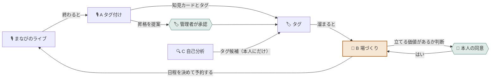

# 学びの輪

> 社内の会話から「いま誰が何を知りたがっていて 誰がそれを知っているか」を読み取り、
> **場を立てる価値があるとAIが自分で判断したときだけ** 人に声をかけて学びの場を立ち上げるプラットフォーム。

**幹事という役割を まるごとAIに渡します。**
人材育成担当に残るのは「やるよ」と言うことだけ。参加者に残るのは「出ます」の返事だけ。

- 📘 設計の正は [`DESIGN.md`](DESIGN.md)
- 🏆 AI HACK 2026（テーマ「業務を自律化するAIエージェント」）
- 🐋 推論はすべて [OrcaRouter](https://www.orcarouter.ai/) を通す

---

## 🎯 誰のどの30分が消えるのか

各企業の**人材育成担当**は、学びの場を1回立てるたびにこれを全部やっています。

| 手間 | いまは誰が |
|---|---|
| 何をテーマにするか決める | 人 |
| 詳しい人を探す | 人 |
| その人に声をかける | 人 |
| みんなの予定を見て日程を決める | 人 |
| 告知文を書く | 人 |
| 記録を残す | 人 |

そして**社員が何を知りたがっているかは見えていません**。だから打ち手が出てこない。

学びの輪は、この**入り口の判断ごと**AIに移します。
既存のナレッジ管理が「書いたものを人が探しに行く」のに対して、これは **「喋ったことが人を呼び集めに行く」**。

---

## 🎙️ まなびのライブ

学びの場は「まなびのライブ」と呼びます。インスタライブや X のスペースに近い形式です。

| 役割 | できること |
|---|---|
| 🎤 **スピーカー** | 音声で話す。知見を持っている側 |
| 💬 **リスナー** | 聞くだけでいい。コメントで口を出せる |

**聞くだけの参加を正式な席として用意している**のが肝です。
「喋らないと気まずい」がなくなると、知識はあるのに前に出にくい人の話が出てきます。

ライブには必ず**始まりと終わり**があります。終わった瞬間がエージェントの出番です。

---

## 🤖 3体のエージェント



| | 起動 | 仕事 |
|---|---|---|
| 🎙️ **A タグ付けエージェント** | ライブが終わったら | 知見カードを切り出し タグを貼る |
| 🎪 **B 場づくりエージェント** | 1日1回 自分で起きる | **立てるか決める** → 打診 → 日程調整 → 予約 |
| 🔍 **C 自己分析エージェント** | 本人がボタンを押したら | 作業中の画面から タグ候補を出す |

### 🎪 B がこの製品の心臓です

B は**閾値で動きません**。毎回こう判断します。

```json
{ "decision": "open" | "wait" | "skip", "confidence": 0.78, "reason": "..." }
```

`wait`（まだ）を選べるのが重要で、**「立てなかった」という判断も理由つきで記録されます**。
判断の材料は数だけではありません。前回からの間隔／顔ぶれの入れ替わり／前回の反応／**前回のライブで「またやりたい」と言われたか**／相談役の負担。

そして **1回で終わりません。** 打診して、断られて、探し直して、日程を決めて、やっと立って、沈黙したら呼び水を投げる。
**日をまたいで1つのゴールを追い続けます。** その進行状態を「企て」として持っています。

---

## 🚪 人が介在するのは4か所だけ

「全部AIがやります」ではありません。**人の介在点を意図的に4か所に絞って設計しています。**

| | ゲート | 誰が |
|---|---|---|
| 1 | 🚪 **相談役への打診** に答える | 打診された本人 |
| 2 | 🏷️ **タグ辞書への昇格**を承認する | 管理者 |
| 3 | 🙋 **未知の話者の名寄せ** をする | 管理者 |
| 4 | 🚨 **例外エスカレーション** を受ける | 管理者 |

これ以外の判断はすべてAIが自分で決めます。

> 管理者には **拒否権**を渡しましたが、**場を立てる承認権**は渡していません。
> 管理者が見ていない週末でも 場は立ち続けます。

> **3 は開発中に見つけた穴です。** タグ付けエージェントが話者名を完全一致で照合していたため
> 「星野陸」と「星野 陸」を別人と判断し、社員アカウントを勝手に4つ作ってしまいました。
> **エージェントに人を作らせない**ことにして、名簿に無い名前が出たライブは
> `needs_review` で止め、名寄せは人が決める形に直しています。

---

## 🛡️ 安全の考え方は3つだけ

自律性を上げるほど、事故ったときの影響は大きくなります。守りは3本に集約しました。

### ① 口を持つのは場づくりエージェントだけ（権限の分離）

通知を送る権限は **B のキーにしか渡していません**。
A が乗っ取られても、**外に出ていくものがありません**。機能ではなく**権限**を分けています。

### ② 入口は辞書で縛る（自由文を書かせない）

タグは自由入力ではなく**辞書からの選択**です。だから会話に紛れ込んだ命令文が、そのまま書き込まれることがありません。

辞書にない新語は3つの検査を通ります。

| 検査 | 落とすもの |
|---|---|
| 形 | 空白・記号を含む長い文字列 ＝ **命令文はここで死にます** |
| 固有名詞 | 顧客名・案件名・社名 |
| 空似 | 文字起こしの誤変換。**かな読みで**既存タグと比べます |

### ③ 止まれるようにする（上限はコードで持つ）

停止条件は LLM に任せず**コードが保証します**。
候補3人で打ち切り／14日で打ち切り／コスト上限。**暴走しても天井を超えません。**

### そのほか

- 元発言は**誘われた人だけ**が読めます。**終了したライブには誰も後から入れません**（DBが断ります）
- 知見カードの本文は**要約**です。発言をそのまま載せません
- カレンダーは **空き／埋まりだけ**取ります。予定のタイトルも参加者も読みません
- 自己分析エージェントは**画像を保存しません**。DBに画像を持つ列自体がありません

---

## 🧰 技術構成

| レイヤー | 採用 |
|---|---|
| フロント | Next.js |
| ホスティング | Vercel |
| DB / 認証 | Supabase（Postgres ＋ RLS） |
| 推論 | **OrcaRouter**（OpenAI互換ゲートウェイ） |

**モデル名はコードに書きません。** OrcaRouter の Named Router に振り分けを任せています。

| 担当 | 使う場面 |
|---|---|
| 安いモデル | タグ貼り・要約・新語の検査・巡回の足切り |
| 強いモデル | 立てるか判断・打診文・タグ昇格の最終確認 |
| Fallback | 別ベンダーを1本（使われない限り課金なし） |

エージェントごとに**スコープ付きAPIキーを3本**発行し、予算上限と有効期限を付けています。

---

## 🚀 動かし方

```bash
git clone https://github.com/Komuro-524/manabi-no-wa.git
cd manabi-no-wa
npm install
cp .env.example .env.local   # 値を入れる
npm run dev
```

必要な環境変数は [`.env.example`](.env.example) にすべて名前だけ書いてあります。
DB のスキーマと RLS は [`DESIGN.md`](DESIGN.md) の §6・§7 にあります。

**本番URL**：準備中

---

## 📁 リポジトリ構成

```
manabi-no-wa/
├── DESIGN.md          設計の正（用語・エージェント・DDL・RLS・守るべきルール）
├── .env.example       環境変数のひな形
├── docs/evidence/     動作と安全性の記録
└── repos/mock/        画面モック
```

---

## 📄 ドキュメント

| ファイル | 中身 |
|---|---|
| [`DESIGN.md`](DESIGN.md) | **設計の正。** 実装前に必ず読む |
| [`DESIGN.md` §8](DESIGN.md) | **絶対に壊してはいけないルール14個。** PR を出す前に読み直す |
| [`docs/evidence/`](docs/evidence/) | 安全性と堅牢性の確認記録 |

---

## 🔭 今回の範囲外

設計としては決めたうえで、今回は実装していないもの。

- **マルチテナント分離** — 1社前提。複数社なら全テーブルに `org_id` を足して RLS の条件に入れる
- **キーの完全分離** — A と B のキーは分けたが同じプロセスにある。防いでいるのは事故であって攻撃ではない
- **カレンダー実連携** — 本番は Outlook の FreeBusy を叩く。予定のタイトルは最初から取りに行かない設計
- **ライブ中のリアルタイム解析** — コストと、雑談が部屋の外に漏れる懸念のため見送り
- **定期開催の設定画面** — 作りません。**興味が溜まれば 結果としてまた開かれます**
